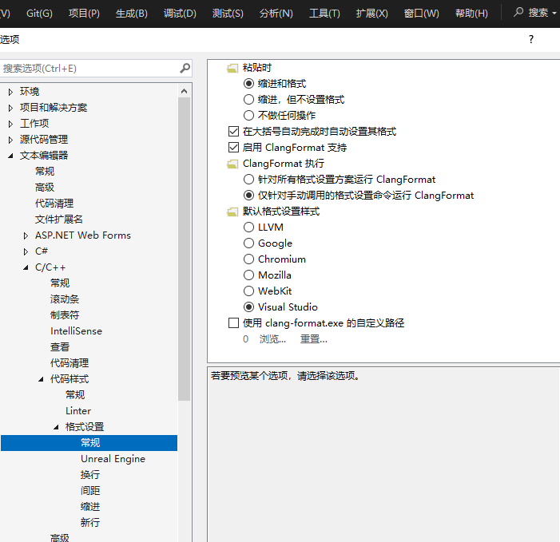

VS2022 使用笔记

# 代码格式化
- clang-format 格式化
VS2022 内部集成 clang-format 工具，可以开启使用。且用 clang-format 也可配置 .clang-format 文件后在 vsCode 中使用相同的格式化配置。
- [C++ EditorConfig 格式设置约定](https://learn.microsoft.com/zh-cn/visualstudio/ide/cpp-editorconfig-properties?view=vs-2019)
在 UI 界面设置格式，然后将设置导出。

## clang-format 格式化代码
> [选项，文本编辑器，C/C++，格式设置 - Visual Studio (Windows)](https://learn.microsoft.com/zh-cn/visualstudio/ide/reference/options-text-editor-c-cpp-formatting?view=vs-2022#configuring-clangformat-options) 
> [Visual Studio和VS Code使用clang-format自定义C++代码默认格式化样式_vs clang-format-CSDN博客](https://blog.csdn.net/xy1157/article/details/93224422) 

VS2022 内部集成 clang-format 工具，可以开启使用。

### VS2022 启用 clang-format


ClangFormat 执行时有两种设置：
1. **针对所有格式方案运行ClangFormat**：编写代码时自动格式化。
2. **仅针对手动调用的格式设置命令运行ClangFormat**：编写代码时不格式化，之后可以手动调用格式化命令进行格式化。

两种方案都不会自动对未修改的代码进行格式化。

### 配置 .clang-format 文件
- 可以通过 [clang-format configurator](https://zed0.co.uk/clang-format-configurator/) 在线编辑和查看样式，最后生成 .clang-format 文件。
- 可以自己编写 .clang-format 文件，参考 [clang-format](https://clang.llvm.org/docs/ClangFormatStyleOptions.html)。
- .clang-format 文件放在项目根目录下。

### 配置 .clang-format-ignore 文件
- 类似 .gitignore 文件，用于忽略某些文件。
- 将该文件放在项目的根目录中，将需要忽略的文件相对于根目录的相对路径写到 .clang-format-ignore 中。
注意路径分隔符，如果在 windows 中，用 windows 分隔符 `\`。
- 没起作用？

### 选择区域格式化
- 格式化整个文档
默认快捷键：设置文档格式(Ctrl+K, Ctrl+D)
- 格式化选择区域
默认快捷键：设置选定内容格式(Ctrl+K, Ctrl+F)

# 代码拼写检查
## Visual Studio Spell Checker 插件进行代码检查
类似 vsCode 中 Code Spell Checker 插件，检查拼写错误。

# 代码分析
- VS2022 自带的 Code Analysis
> [快速入门：C/C++ 代码分析](https://learn.microsoft.com/zh-cn/cpp/code-quality/quick-start-code-analysis-for-c-cpp?view=msvc-170) 
配置规则集
- VS2022 集成的 clang-tidy
> [Clang-Tidy — Extra Clang Tools 19.0.0git documentation](https://clang.llvm.org/extra/clang-tidy/) 
写 .clang-tidy 文件，配置规则。如果用 vsCode 写代码，写的规则文件可以在 vsCode 中使用。

## clang-tidy 进行代码分析
> [Welcome to Extra Clang Tools's documentation! — Extra Clang Tools 19.0.0git documentation](https://clang.llvm.org/extra/index.html) 
> [clang-tidy - Clang-Tidy Checks — Extra Clang Tools 19.0.0git documentation](https://clang.llvm.org/extra/clang-tidy/checks/list.html) 
### 变量命名规范
> [在 Visual Studio 中使用 Clang-Tidy](https://learn.microsoft.com/zh-cn/cpp/code-quality/clang-tidy?view=msvc-170#clang-tidy-configuration) 

- VS2022 默认集成了 clang-tidy 工具，可以开启使用。

#### 启用 clang-tidy
在项目“属性页”对话框中，打开“配置属性”>“Code Analysis”>“常规”->“启用 Clang-Tidy”选项 选择 “是”。

#### 配置 .clang-tidy
根据 [clang-tidy - readability-identifier-naming — Extra Clang Tools 19.0.0git documentation](https://clang.llvm.org/extra/clang-tidy/checks/readability/identifier-naming.html) 设置变量命名规范，写到 .clang-tidy 文件中，可以将文件放在项目的根目录。

例如：
```yaml
Checks: >
  - readability-identifier-naming
WarningsAsErrors: '*'
HeaderFilterRegex: '.*'
AnalyzeTemporaryDtors: true
CheckOptions:
  - key: readability-identifier-naming.ClassCase
    value: CamelCase
  - key: readability-identifier-naming.StructCase
    value: CamelCase
  - key: readability-identifier-naming.EnumCase
    value: CamelCase
  - key: readability-identifier-naming.FunctionCase
    value: CamelCase
  - key: readability-identifier-naming.VariableCase
    value: camelBack
  - key: readability-identifier-naming.GlobalVariablePrefix
    value: 'g_'
  - key: readability-identifier-naming.GlobalVariableCase
    value: 'camelBack'
  - key: readability-identifier-naming.MemberPrefix
    value: 'm_'
  - key: readability-identifier-naming.MemberCase
    value: camelBack
  - key: readability-identifier-naming.ConstantCase
    value: UPPER_CASE
  - key: readability-identifier-naming.EnumConstantCase
    value: UPPER_CASE
```
`>`符号被用来引入“折叠”模式（Folded Style），允许多行字符串在YAML中被表示为单行。使用`>`后，字符串中的换行会被转换为空格，除非有一个空行表示新的段落。

- `Checks: > - readability-identifier-naming`：指定应该执行的检查列表，这里只启用了`readability-identifier-naming`检查，用于标识符的命名规范。
- `WarningsAsErrors: '*'`：将所有警告视为错误，意味着任何满足警告条件的代码都会导致构建失败。
- `HeaderFilterRegex: '.*'`：指定一个正则表达式，用于过滤哪些头文件应该被这个`.clang-tidy`配置检查。这里的`'.*'`意味着对所有文件进行检查。
- `AnalyzeTemporaryDtors: true`：启用对临时对象析构函数的分析。
- `CheckOptions:`：以下是具体的命名规范设置：
  - `ClassCase: CamelCase`：类名使用大驼峰命名规则。
  - `StructCase: CamelCase`：结构体名使用大驼峰命名规则。
  - `EnumCase: CamelCase`：枚举类型使用大驼峰命名规则。
  - `FunctionCase: camelBack`：函数名使用小驼峰命名规则。
  - `VariableCase: camelBack`：变量名使用小驼峰命名规则。
  - `GlobalVariablePrefix: 'g_'`：全局变量名前必须附带前缀`g_`。
  - `MemberPrefix: 'm_'`：类成员变量的命名需要以`m_`为前缀。
  - `ConstantCase: UPPER_CASE`：常量名使用大写字母并用下划线分隔。
  - `MacroDefinitionCase: UPPER_CASE`：宏定义使用大写字母并用下划线分隔。

或者用如下格式：
```yaml
Checks: >
  -*,
  clang-analyzer-*,
  -clang-analyzer-cplusplus*
```
这里的`-`符号位于每个检查器名称前，但这实际上是YAML语法的一部分，用于表示列表项而不是禁用检查器的标志。在YAML中，列表可以用`- `（横杠加一个空格）来表示每个元素。因此，在这个上下文中，`-`不是禁用检查器的表示，而是声明一个项列表。

这里首先出现的`-*`，意味着**禁用所有检查器**。其后的`clang-analyzer-*`表示启用以`clang-analyzer-`开头的所有检查器。接着，`-clang-analyzer-cplusplus*`则表示**禁用**所有以`clang-analyzer-cplusplus`开头的检查器。这个场景中的`-`符号用于`-*`和`-clang-analyzer-cplusplus*`是表示禁用的意思，而不是YAML中的列表标记。

当使用`>`符号进入折叠模式后，后续的文本被认为是单一字符串的一部分，而不是一个列表项。这与普通的YAML列表（通过在每一项前添加`-`符号标识）不同。
在这种模式下，字符串内可以包含逗号`,`来分隔不同的检查器配置项。因此，它被视为一个长字符串而非多个列表项。
因此，在使用`>`后，我们直接将检查器的命令作为一长串文本输入，不需逐项添加`-`符号，因为此时的上下文不是声明一个YAML列表，而是将多行文本折叠成单行字符串。

### 代码可读性检查
#### magic-number 检查
> [clang-tidy - readability-magic-numbers — Extra Clang Tools 19.0.0git documentation](https://clang.llvm.org/extra/clang-tidy/checks/readability/magic-numbers.html#readability-magic-numbers) 

- readability-magic-numbers

### 代码复杂度检查
> [clang-tidy - readability-function-cognitive-complexity — Extra Clang Tools 19.0.0git documentation](https://clang.llvm.org/extra/clang-tidy/checks/readability/function-cognitive-complexity.html) 
> [clang-tidy - readability-function-size — Extra Clang Tools 19.0.0git documentation](https://clang.llvm.org/extra/clang-tidy/checks/readability/function-size.html)

- 圈复杂度检查
readability-function-cognitive-complexity
- 函数长度检查
readability-function-size.LineThreshold
不会忽略注释行和空白行？
- 函数嵌套深度检查
readability-function-size.NestingThreshold
- 参数数量检查
readability-function-size.ParameterThreshold

### 代码安全性检查
- clang-analyzer-*

#### 变量初始化检查
> [clang-tidy - cppcoreguidelines-init-variables — Extra Clang Tools 19.0.0git documentation](https://clang.llvm.org/extra/clang-tidy/checks/cppcoreguidelines/init-variables.html) 

- cppcoreguidelines-init-variables

#### 空指针解引用
> [1. Available Checkers — Clang 19.0.0git documentation](https://clang.llvm.org/docs/analyzer/checkers.html#core-nulldereference) 

- clang-analyzer-core.NullDereference

#### 内存泄漏
> [1. Available Checkers — Clang 19.0.0git documentation](https://clang.llvm.org/docs/analyzer/checkers.html#cplusplus-newdelete) 
> [1. Available Checkers — Clang 19.0.0git documentation](https://clang.llvm.org/docs/analyzer/checkers.html#cplusplus-newdeleteleaks) 

- clang-analyzer-cplusplus.NewDelete
- clang-analyzer-cplusplus.NewDeleteLeaks

### 性能优化检查
- performance-*

开启所有性能优化检查。

#### 不必要的拷贝
> [clang-tidy - performance-unnecessary-copy-initialization — Extra Clang Tools 19.0.0git documentation](https://clang.llvm.org/extra/clang-tidy/checks/performance/unnecessary-copy-initialization.html) 

- performance-unnecessary-copy-initialization

这个检查器会标记出那些通过拷贝初始化但实际上可以避免拷贝的情况，推荐使用引用或者直接移动语义。

### 现代化建议
旧 c++ 代码替换为现代 c++ 代码模式

- auto 的使用
modernize-use-auto
- 用智能指针
modernize-make-smart-pointers

### bugprone 检查
要配置`clang-tidy`以检查并发编程中的问题（如死锁）以及易于引发错误的代码模式（如错误的类型转换，未初始化的成员变量等），可以使用以下检查器：
- `bugprone-incorrect-roundings`：识别不正确的舍入方法。
- `bugprone-integer-division`：意外的整数除法导致的结果问题。
- `bugprone-use-after-move`：移动后使用。
- `bugprone-bad-signal-to-kill-thread`：在线程中使用错误的信号量。
- `bugprone-narrowing-conversions`：识别狭窄类型转换，可能丢失数据。

```yaml
Checks: >
  *,
  -*,
  bugprone-incorrect-roundings,
  bugprone-integer-division,
  bugprone-use-after-move,
  bugprone-bad-signal-to-kill-thread,
  bugprone-narrowing-conversions
```

## 排除某些文件
> [Clang-Tidy — Extra Clang Tools 19.0.0git documentation](https://clang.llvm.org/extra/clang-tidy/#using-clang-tidy) 

```
 --exclude-header-filter=<string> - Regular expression matching the names of the
                                     headers to exclude diagnostics from. Diagnostics
                                     from the main file of each translation unit are
                                     always displayed.
                                     Must be used together with --header-filter.
                                     Can be used together with -line-filter.
                                     This option overrides the 'ExcludeHeaderFilterRegex'
                                     option in .clang-tidy file, if any.
```

不是在 .clang-tidy 中设置，而是 clang-tidy 运行时指定的参数，可以在命令行运行 clang-tidy 时指定。

## 导出检查的建议
> [Clang-Tidy — Extra Clang Tools 19.0.0git documentation](https://clang.llvm.org/extra/clang-tidy/#exporting-checker-suggestions)

```
--export-fixes=<filename>        - YAML file to store suggested fixes in. The
                                     stored fixes can be applied to the input source
                                     code with clang-apply-replacements.
```
不是在 .clang-tidy 中设置，而是 clang-tidy 运行时指定的参数，可以在命令行运行 clang-tidy 时指定。

# 示例
## .clang-tidy
```yaml
Checks: >
  - readability-identifier-naming
  - cppcoreguidelines-init-variables
  - readability-function-cognitive-complexity
  - readability-function-size
  - readability-magic-numbers
  # - clang-analyzer-*
  - clang-analyzer-core.NullDereference
  - clang-analyzer-cplusplus.NewDelete
  - clang-analyzer-cplusplus.NewDeleteLeaks
  - performance-*
  - modernize-use-auto
  - modernize-make-smart-pointers
  - bugprone-incorrect-roundings
  - bugprone-integer-division
  - bugprone-use-after-move
  - bugprone-bad-signal-to-kill-thread
  - bugprone-narrowing-conversions
CheckOptions:
  - key: readability-identifier-naming.ClassCase
    value: CamelCase
  - key: readability-identifier-naming.StructCase
    value: CamelCase
  - key: readability-identifier-naming.EnumCase
    value: CamelCase
  - key: readability-identifier-naming.FunctionCase
    value: CamelCase
  - key: readability-identifier-naming.VariableCase
    value: camelBack
  - key: readability-identifier-naming.GlobalVariablePrefix
    value: 'g_'
  - key: readability-identifier-naming.GlobalVariableCase
    value: 'camelBack'
  - key: readability-identifier-naming.MemberPrefix
    value: 'm_'
  - key: readability-identifier-naming.MemberCase
    value: camelBack
  - key: readability-identifier-naming.ConstantCase
    value: UPPER_CASE
  - key: readability-identifier-naming.EnumConstantCase
    value: UPPER_CASE
  - key: readability-function-cognitive-complexity.Threshold
    value: 20 
  - key: readability-function-cognitive-complexity.DescribeBasicIncrements
    value: true
  - key: readability-function-cognitive-complexity.IgnoreMacros
    value: false
  - key: readability-function-size.LineThreshold
    value: 50
  - key: readability-function-size.NestingThreshold
    value: 4
  - key: readability-function-size.ParameterThreshold
    value: 6
```

## .clang-tidy
```yaml
Checks: >
  *,
  -*,
  readability-identifier-naming,
  cppcoreguidelines-init-variables,
  readability-function-cognitive-complexity,
  readability-function-size,
  readability-magic-numbers,
  clang-analyzer-core.NullDereference,
  clang-analyzer-cplusplus.NewDelete,
  clang-analyzer-cplusplus.NewDeleteLeaks,
  performance-*,
  modernize-use-auto,
  modernize-make-smart-pointers,
  bugprone-incorrect-roundings,
  bugprone-integer-division,
  bugprone-use-after-move,
  bugprone-bad-signal-to-kill-thread,
  bugprone-narrowing-conversions
CheckOptions:
  - key: readability-identifier-naming.ClassCase
    value: CamelCase
  - key: readability-identifier-naming.StructCase
    value: CamelCase
  - key: readability-identifier-naming.EnumCase
    value: CamelCase
  - key: readability-identifier-naming.FunctionCase
    value: CamelCase
  - key: readability-identifier-naming.VariableCase
    value: camelBack
  - key: readability-identifier-naming.GlobalVariablePrefix
    value: 'g_'
  - key: readability-identifier-naming.GlobalVariableCase
    value: 'camelBack'
  - key: readability-identifier-naming.MemberPrefix
    value: 'm_'
  - key: readability-identifier-naming.MemberCase
    value: camelBack
  - key: readability-identifier-naming.ConstantCase
    value: UPPER_CASE
  - key: readability-identifier-naming.EnumConstantCase
    value: UPPER_CASE
  - key: readability-function-cognitive-complexity.Threshold
    value: 20 
  - key: readability-function-cognitive-complexity.DescribeBasicIncrements
    value: true
  - key: readability-function-cognitive-complexity.IgnoreMacros
    value: false
  - key: readability-function-size.LineThreshold
    value: 50
  - key: readability-function-size.NestingThreshold
    value: 4
  - key: readability-function-size.ParameterThreshold
    value: 6
```

## .clang-format
```yaml
# 通用规则（适用于C/C++）  
# BasedOnStyle:    Google  
BasedOnStyle: Google  
# 空格代替 tab  
UseTab:          Never  
TabWidth:        4  
IndentWidth:     4  
# 列数限制  
ColumnLimit:     120  
# 花括号包裹方式  
BreakBeforeBraces: Allman  
# 指针和引用的位置  
DerivePointerAlignment: false
PointerAlignment: Right  # 或者 Left, Middle  
# 控制是否对齐连续的赋值语句。  
AlignConsecutiveAssignments: true  
# 控制是否对齐尾随注释。  
AlignTrailingComments: true  
# 控制是否允许短函数写在一行。  
AllowShortFunctionsOnASingleLine: All  # 或者 None, InlineOnly, Empty  
# 控制尾随注释前的空格数。  
SpacesBeforeTrailingComments: 2  
# 控制关键字和左括号之间的空格。  
SpaceBeforeParens: ControlStatements # Never, Always
# 控制 `case` 标签的缩进。  
IndentCaseLabels: true  

---  

Language:        Cpp  
# C++的独特规则  
Standard:        Cpp11  

# 控制语句之后总是换行
AfterControlStatement: Always 
# 函数定义后换行
AfterFunction: true 
# 命名空间定义后换行
AfterNamespace: true 
# 结构体定义后换行
AfterStruct: true 
# 类定义后换行
AfterClass: true 
# 联合体定义后换行
AfterUnion: true 
```